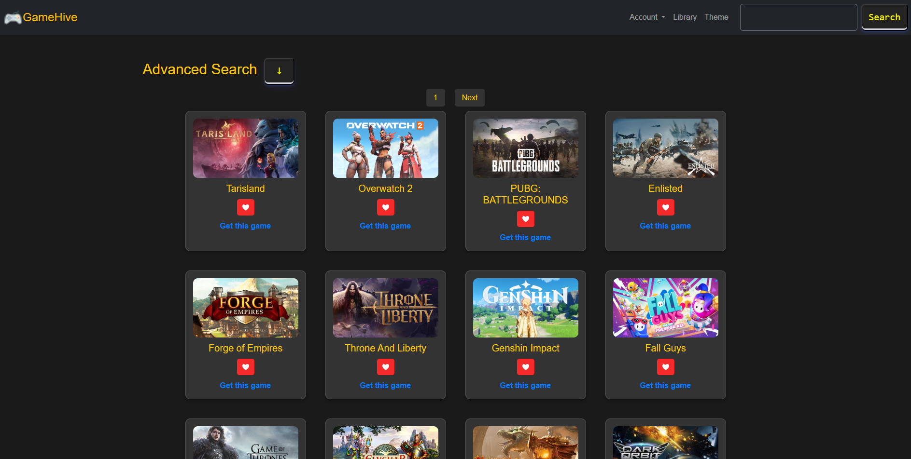
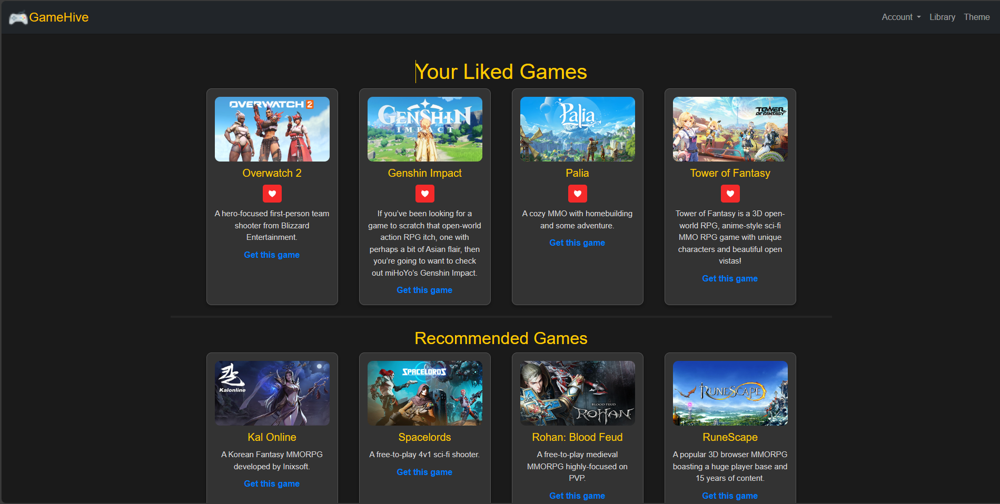
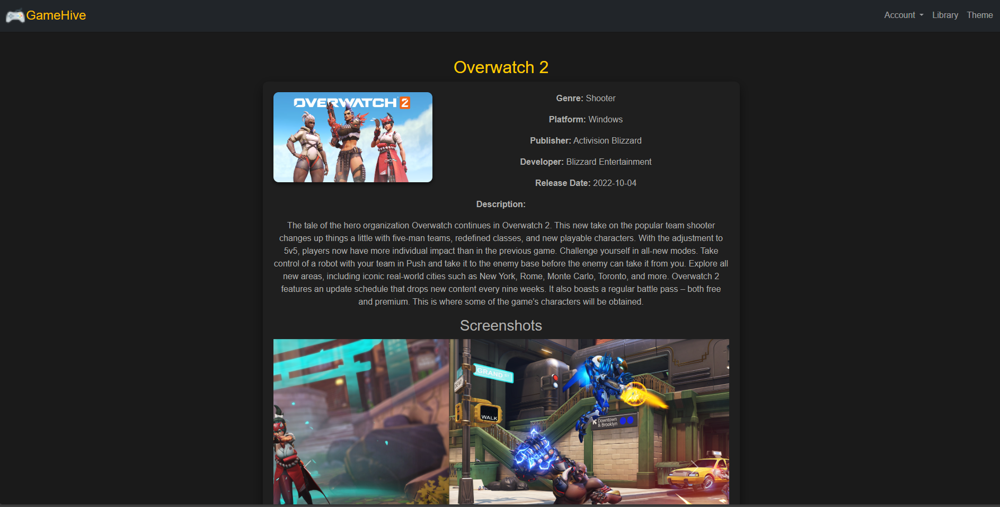
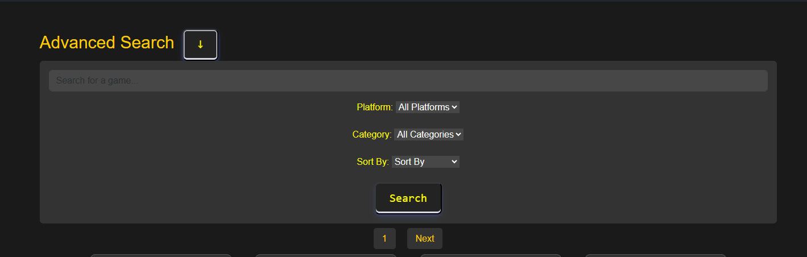

# GameHive - CS50 Final Project
#### Video Demo:  [Watch Here](https://www.youtube.com/watch?v=2EdBd5nvfL4)
#### Description:  A game searching web app that allow users to search for specific games and apply advanced filtering methods to refine results.

## Introduction
GameHive is a web application for the searching and management of games using the API provided by FreeToGame. This is a platform with an all-encompassing catalog of games-including all details and categorization-for an improved user experience. The major features in this application include:

- **User Authentication:** Users can create accounts, log in, log out and change their account password, including the option to delete their accounts.

- **Game Discovery and Exploration:** Users can refine their searches using various categories and advanced filtering by genre, platform, and more.

- **Personalized Library:** A key feature of the application is the ability for users to add their favorite game their library. By liking games. Library allow users to save their personal collection of games for future use, Also library provides personalized recommondations of games based on user's liked game categories.

## Core Features
### 1.User Registration
Users must create an account to access GameHive. Registration includes:

Form validation(POST):
- **Missing Username:** If user tried to register without a username, the system will display a message.  "Username is required."
- **Username Restriction:** Usernames are limited only to letters (no special characters) using regular expressions. Also considering username length.
Excessive Username Length: A maximum character limit for usernames is enforced to prevent potential database issues.
Secure Password Hashing: If all validation checks pass, the user's password is securely hashed using Flask-WTF's generate_password_hash function. This one-way hashing process prevents storing passwords in plain text, enhancing security.
- **Missing Password:** If user tried to register without a password, system will display a message.  "Password is required."
                        Same as for confirme password.  "Password confirmation is required."
- **Password Matching:** After user submitted password and its confirmation, if not matched both, the display a message.  "Passwords do not match."
- **Password Strength:** Password will validate using regular expressions to check it contains:
  - Special characters ([!@#$%^&*()])
  - Digits ([0-9])
- **Password Hashing:** After successfully passed all rules, password will hashed by werkzeug.security, and then inserting both username and hased password to users table. then user will redirect to login page. ("/login")

### 2.User Login
This part allows user login to GameHiive homepage.

When a user press the login button (POST), the existing user session will clear using session.clear(). This ensures that any previous user's session data is removed before a new login attempt.

From validation(POST):
- **Missing Username:** If user tried to register without a username, the system will display a message.  "Username is required."
- **Missing Password:** If user tried to register without a password, system will display a message.  "Password is required."

- **Database query and authentication:**
  - **Database lookup:** A database query will execute to get users info from users table.  "SELECT * FROM users WHERE username = (?)"
  - **User data verification:** The code checks two conditions:
    - Check whether registerd user availble or not.  if len(rows) != 1
    - Get hashed password from database and compare with user input password.   check_password_hash(rows[0]["hash"]) 

Finally establishes a logged-in session for the user. And shows a success message and redirecting to home page.  (/)

### 3.Game Search and Detail View
This part show the core functionality of the application: searching for and displaying games.

Route Configuration:
The index route is defined with two URL patterns:
- /: Handles the root path without a specific game ID, displaying a game listing page(normally home page).
- /\<int:game_id>: Handles URLs with an integer game ID, allowing users to view details of a specific game.
User Context and Search Parameters:

An API request URL is constructed based on the FreeToGame API URL and the extracted parameters (API_URL) using a dictionary (params).
The request URL is dynamically built based on the presence of filters:
- If platform is provided, it's added to the params.
- If category is provided, it's added to the params.
- If sort (order) is provided, it's added to the params.

Fetching and Filtering Games:
- The application makes a GET request to the FreeToGame API using the constructed URL with requests.get().
- The response JSON is parsed and stored in the games variable.
- If a search query (query) exists, the games are filtered to include only those with matching titles.

Pagination:
- 30 number of games are display per a page.

Handling Game Details:
If a specific game ID is in the URL:
- Another GET request is made to the API, with a specific game ID including to the URL.
- The detailed.html template is rendered, displaying the specific game details.

Rendering Results:
For the root path (/), the index.html template is rendered:
- games: List of paginated games for the current page.
- current_page: Current page number.
- total_pages: Total number of pages.

### 4.Library
This part shows the user's library feature and game liking feature.

User's Liked Games:
- The /library route displays a user's library of liked games.

Liking a Game (add to library):
- The /like route handles the liking of a game.
- The user's id and game the ids are collects.
- Validation to check game ID is provided.
- also have queries to check in likes table to see if the user already liked to the specific game.
- If a duplicate is found, an error message will display.
- If the game is not already liked:
  - A new entry is inserted into the likes table with the user ID and game ID.
- Tags are extracted from the game data.
- Each tag is inserted into the liked_game_tags table, associating it with the like record's ID, INSERT INTO liked_game_tags (like_id, tag) VALUES (?, ?)

Getting Liked Games:
- A database query retrieves game IDs from the likes table where the userid matches the logged-in user, SELECT gameid FROM likes WHERE userid = ?
- If liked games exist:
  - A list of game IDs will collect.
  - For each game ID, an API request is made to the API to get game information.

Unliking a Game (removing from the library):
- The /unlike route handles the unliking of a game.
- The user's id and game the ids are collects.
- Validation to check game ID is provided.
- also have queries to check in likes table to see if the user already liked to the specific game.
- If a duplicate is found, an error message will display.
- If the game is not already liked:
  - A new entry is inserted into the likes table with the user ID and game ID.
- Tags are extracted from the game data.
- Each tag is inserted into the liked_game_tags table, associating it with the like record's ID, INSERT INTO liked_game_tags (like_id, tag) VALUES (?, ?)

Game Recommendations:
Here show how the game recommendation are make by user's liked games category.

It gets categories(tags) associated with the user's liked games, SELECT tag FROM liked_game_tags WHERE like_id IN (SELECT id FROM likes WHERE userid = (?))
- Tag frequency is calculated:
  - Top 3 most frequent tags are identified using sorting with sorted and tag_counts.get.
- For each top tag:
  - the API request gets games based on the tag category

- Rendering Library:
- so when library.html template is render, and its displaying:
  - Liked Games(user's liked games with detailed information) and Recommended Games(Top 5 recommended games will show).

## Also this webapp has couple more features that contribute to complete user experience:
### 1.Change Password: 
  - User allows to change their password by verifying their live password(currnent one). By checking the user provided old password and it verify with the password that gets from database and convert from hash, if they are same then user is allowed to change their password.
### 2.Delete Account: 
  - Users can permanently delete their accounts and associated data such as liked games, liked games tags. After user confirm the deletion by providing their password, and thne the user's data will be deleted from the database permanetly.
### 3.Unlike a Game: 
  - Users can remove games from their own library by "unliking" them. After clicking on unlike icon(heart shaped), user will remove that game from the library. So this allows users to manage their liked game collections and refine their game recommendations.
### 4.Logout: 
  - This logout function allows users to end their sessions. After user click on logout button, user will be logged out and will be redirected to the login page clearing all the session's user data.

These user friendly features improve the overall user experience by providing account management options and further personalization(like changing theme between light and dark).

## Technology Stack
- Frontend: HTML, CSS, JavaScript
- CSS Framework: Bootstrap
- Backend: Flask (Python)
- API: Freetogame API
- Database: SQLite3

## How To Use
-  ### Insttall project dependencies by running `pip install -r requirements.txt`
-  ### Run the Application by executing flask run
    - you will see server at http://127.0.0.1:5000
-  ### Interacting with the Web Application
    - Create an Account: Register a new account by clicking the "Register" button on the homepage.
    - Log In: Use your credentials to log in and start using the game search features.
    - Search Games: Use the search bar and apply filters to find games.
    - Add Games to Library: Like a game to add it to the user's library.
    - Game Recommendations: Get recommendations based on the games that you liked.
    - Account Management: Change your password or delete your or logout by clicking account button.

## Source Files
| File/Directory | Description                                                                    |
|---|---|
| `app.py` | **Main application file:** Defines the Flask app and handles backend logic. |
| `helpers.py` | **Helper functions:** Contains functions for tasks like hashing passwords and checking if a user is logged in. |
| `games.db` | **SQLite database:** Stores user data and game information. Includes tables like `users`, `likes`, and `liked_game_tags`. |
| `/templates` | **HTML templates directory:** Contains the HTML files used for the web app. |
|  - `layout.html` | **Base template:** Provides the foundation for all pages, including the navigation bar and common elements. |
|  - `index.html` | **Home page template:** Displays the Home page. |
|  - `login.html` | **Login template:** The login page template for user authentication. |
|  - `register.html` | **Register template:** Provides the foundation for all pages, including the navigation bar and common elements. |
|  - `library.html` | **Library template:** Displays the user's liked games and recommendations. |
|  - `detailed.html` | **Detailed View template:** Shows detailed information about a specific game. |
|  - `changePassword.html` | **Password change template:** Allows users to change their password. |
|  - `delete.html` | **Account delete template:** Allows users to delete their account.  |
| `/static` | **Static files directory:** Stores static resources like CSS, JavaScript, images, etc. |
|  - `/CSS` |  - `styles.css` | Main CSS file for styling all templates. |
|  - `/images` |    - `/carousels` | Contains images that use in login page's carousel (e.g., `1.jpg`, `2.jpg`, `3.jpg`). |
|  - `/js` |    - `script.js` | JavaScript file for handling the web app's theme and functionality. |
|  - `/screenshots` | Contains preview images(screenshots) of the web app. |
| `requirements.txt` | **Dependency list:** Lists the required packages to run the application. |

## Screenshots
### Home Page

### Library Page

### Detailed View

### Advanced Filters

## About Me
Hello! I'm Methuka Pasandul, an 18-year-old developer from Sri Lanka. GameHive is my CS50 final project, designed to simplify game discovery using advanced filters. The app currently supports over 400 games, as provided by the FreeToGame API.

In the future, I plan to implement more features like user reviews, public comments, enchanced user profile and dynamic content updates. Thank you for exploring GameHive!
